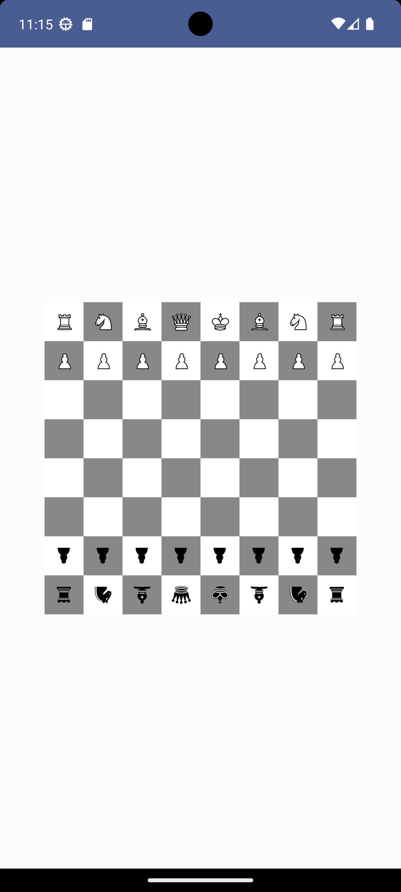
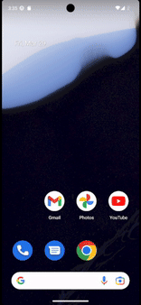

# Jetpack Compose Canvas Examples

Welcome to the Jetpack Compose Canvas Examples repository! This repository contains examples showcasing the capabilities of Jetpack Compose Canvas, a powerful tool for creating custom UI elements in Android apps.

## Overview

Jetpack Compose is a modern UI toolkit for building native Android apps. With Jetpack Compose Canvas, developers can create custom graphics and interactive elements directly within their apps, allowing for highly customized user interfaces.

## Current Project: Chessboard

We are currently building a chessboard example using Jetpack Compose Canvas. This example will demonstrate how to create a customizable and interactive chessboard UI for your Android app.

### Features:

- Customizable board colors and piece designs
- Interactive piece movements

Stay tuned for updates as we continue to develop this example!

## Example Screenshots

Here's a screenshot of the chessboard in its current state:

